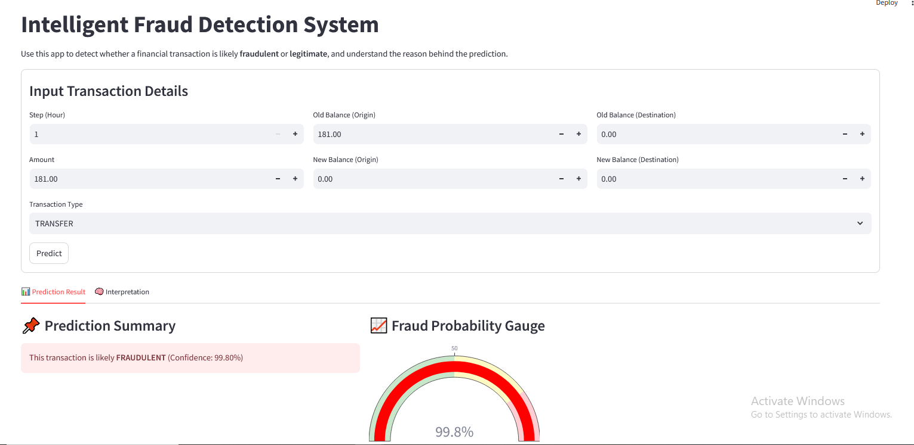

# 💳 Fraud Detection Web App using XGBoost & Streamlit

This project is an intelligent fraud detection system built using **XGBoost** and deployed via **Streamlit**. It analyzes transaction details and predicts the likelihood of fraud, offering interpretable visual explanations using SHAP.

---

## 📌 Features

-  High-accuracy fraud prediction using `XGBoost`
-  SHAP visualizations to interpret model decisions
-  Clean UI built with `Streamlit`
-  Fraud probability gauge chart
-  Feature engineering for improved performance

---

## 🛠 Technologies Used

| Tool            | Purpose                                  |
|-----------------|------------------------------------------|
| Python          | Programming language                     |
| XGBoost         | Fraud prediction model                   |
| SHAP            | Explainable AI / Model interpretation    |
| Streamlit       | Web interface                            |
| Joblib          | Saving and loading models                |
| Pandas / NumPy  | Data processing                          |
| Matplotlib / Plotly | Visualizations                      |

---

## 🚀 How to Run the App Locally

### 1. Clone the repository
```bash
git clone https://github.com/your-username/fraud-detection-app.git
cd fraud-detection-app
```

### 2. Install dependencies
```bash
pip install -r requirements.txt
```

### 3. Launch the Streamlit app
```bash
streamlit run app.py
```

### 📸 Example Prediction Output


## 🔍 Model Overview

     Trained on a real-world financial transactions dataset

     Balanced using SMOTE to handle class imbalance

     Engineered features: diffOrig, diffDest for better signal

     Label encoded categorical feature: type (e.g., CASH_OUT → 2)

## 📁 Project Structure
```bash
├── app.py                 # Main Streamlit app
├── Fraud.ipynb            # Notebook for data exploration / model training
├── fraud_xgb_model.pkl    # Trained XGBoost model
├── label_encoder.pkl      # Label encoder for 'type'
├── requirements.txt       # Required Python packages
├── README.md              # Project documentation
└── example_output.png     # Screenshot showing app prediction output
```

